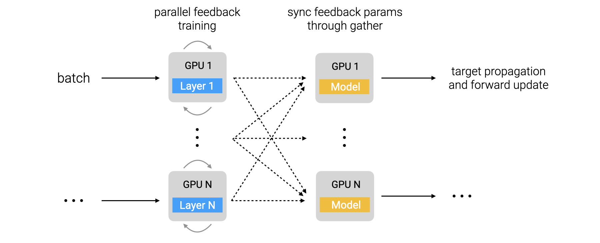
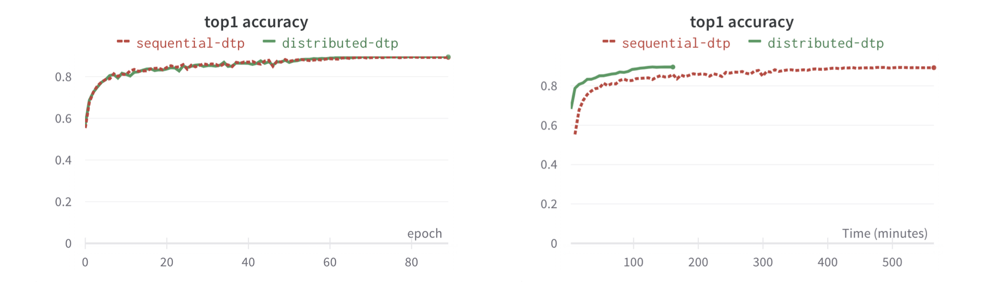

# Distributed DTP

This repository contains the distributed implementation of our work "Towards Scaling Difference Target Propagation with Backprop Targets" accepted to ICML 2022. It implements a custom distributed scheme for our proposed Difference Target Propagation (DTP) algorithm by parallelizing feedback weight training.



## Installation

```
pip install -e .
```

The following code runs on Python > 3.6 with Pytorch 1.7.0.

## Running the code


### Layer parallel implementation

For fast DTP training with layer parallelism on CIFAR-10, do:
```
python main.py model=layer_parallel_dtp \
    trainer=layer_parallel \
    scheduler=cosine \
    network=simple_vgg \
    datamodule=cifar10 \
    datamodule.num_workers=1 \
    trainer.gpus=6
```
The above command will launch N processes corresponding to N layers in the backward net. Any number of GPUs can be passed via command line; each process will use GPU device `rank % trainer.gpus`.


It is recommended to use `trainer.gpus=1` for debugging.


For ImageNet, do:
```
python main.py model=layer_parallel_dtp \
    trainer=layer_parallel \
    scheduler=cosine \
    network=simple_vgg \
    datamodule=imagenet32 \
    datamodule.num_workers=1 \
    trainer.gpus=6 \
    datamodule.batch_size=256 \
    model.hparams.feedback_training_iterations=[25,35,40,60,25] \
    model.hparams.f_optim.lr=0.01 \
    model.hparams.b_optim.momentum=0.9 \
    model.hparams.b_optim.lr=[1e-4,3.5e-4,8e-3,8e-3,0.18]
```

### Sequential implementation
To train with DTP on CIFAR-10, do:
```
python main.py \
    model=dtp \
    network=simple_vgg \
    datamodule=cifar10 \
    trainer=default \
    scheduler=cosine
```

To reproduce the experiment results from a complete config, run:
```
python main.py reproduce=imagenet32_simple_vgg_dtp
```

The following example demonstrates overriding the default config through command line:
```
python main.py \
    model=dtp \
    network=simple_vgg \
    datamodule=imagenet32 \
    trainer=default \
    scheduler=cosine \
    seed=123 \
    datamodule.batch_size=256 \
    model.hparams.feedback_training_iterations=[25,35,40,60,25] \
    model.hparams.f_optim.lr=0.01 \
    model.hparams.b_optim.momentum=0.9 \
    model.hparams.b_optim.lr=[1e-4,3.5e-4,8e-3,8e-3,0.18]
```

## Results

This distributed implementation achieves the same overall performance as the default sequential one but finishes much faster depending on the resources available for workers. Following is an example comparing the two implementations on CIFAR-10:



(Left) Top1 validation accuracy plots on CIFAR-10 comparing default sequential DTP and our distributed DTP implementation. Our distributed DTP implementation achieves same performance as sequential DTP. (Right) Same Top1 validation accuracy on CIFAR-10 plotted against wall clock time. Our distributed DTP implementation finishes in less than 1/4th time of the sequential DTP by utilizing 2 RTX 3090 GPUs.

## License
MIT